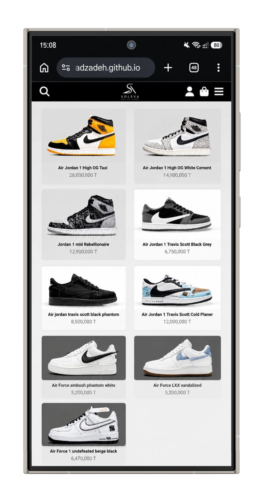
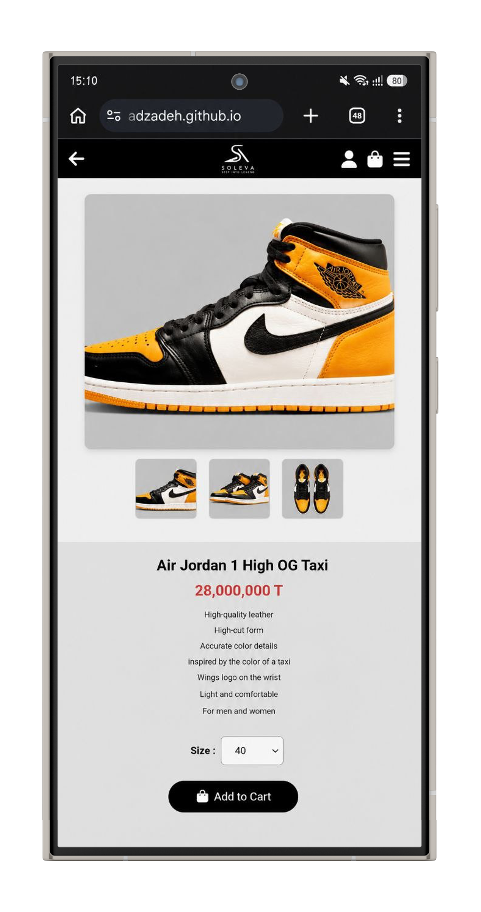
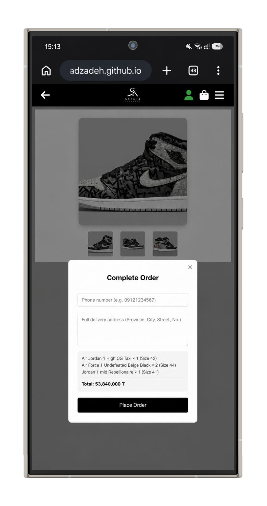
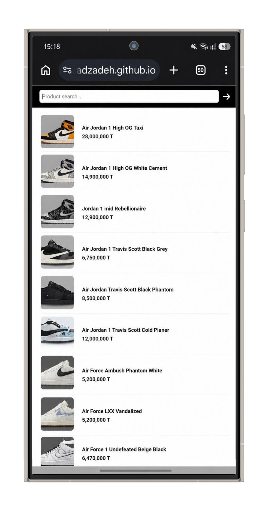

# Soleva 👟

An online sneaker store built with vanilla HTML, CSS, and JavaScript — no frameworks, no backend.

---

## Features

- **Product Catalog** — 9 sneakers displayed in a responsive 3-column grid
- **Product Detail Page** — image gallery, description, size selector, and add to cart
- **Shopping Cart** — add, remove, update quantity, and view total
- **Search** — real-time product search by name
- **User Authentication** — register and login system with session persistence
- **Email Validation** — checks for valid email format on register and login
- **Checkout Protection** — checkout is only accessible to logged-in users

---

## Tech Stack

| Layer | Technology |
|---|---|
| Markup | HTML5 |
| Styling | CSS3 |
| Logic | Vanilla JavaScript |
| Storage | localStorage |
| Icons | Font Awesome 6.5 |

---

## Project Structure

```
soleva/
├── index.html          # Main page (product listing)
├── product.html        # Product detail page
├── style.css           # All styles
├── script.js           # All logic (cart, auth, search)
├── manifest.json       # PWA manifest
└── images/             # Product and logo images
```

---

## How to Run

1. Clone the repository:
   ```bash
   git clone https://github.com/your-username/soleva.git
   ```
2. Open `index.html` in your browser — or use [Live Server](https://marketplace.visualstudio.com/items?itemName=ritwickdey.LiveServer) in VS Code.

> No build step or install needed.

---

## Authentication Notes

- User accounts are stored in `localStorage` (client-side only)
- Sessions persist across page refreshes
- Passwords are stored as plain text — **not suitable for production**
- Email validation uses regex: must include `@` and a valid domain

---

## 📱 Screenshots

<div align="center">
  
  
  
  
</div>

---

## ⭐ Show Your Support
If you found this project helpful, please give it a ⭐!

---

👨‍💻 Author
Mehrab Javadzadeh 
Amirmahdi Khodabandelou

---

## License

This project is for personal/educational use.
